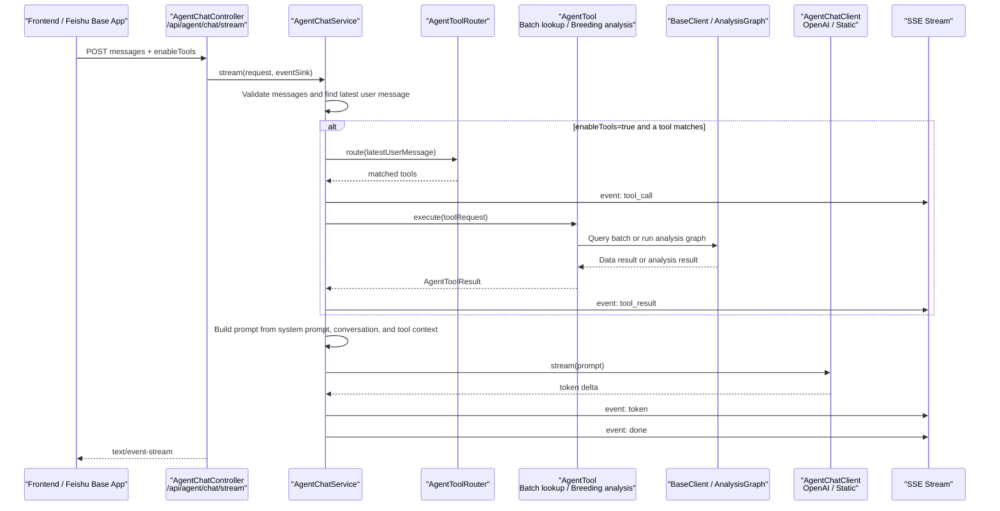
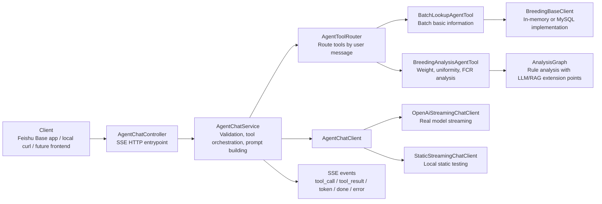

# Breeding AI Backend

Java AI backend for the Feishu Base breeding management project.

## Current Milestone

The current milestone upgrades the backend to a Java 21 / Spring Boot 3.5
multi-module project with:

- Spring Boot application module: `ai-app`
- AI graph runtime module: `ai-graph-runtime`
- Feishu Base client module: `lark-base-client`
- Feishu IM client module: `lark-im-client`
- Feishu bot long-connection adapter module: `lark-bot-long-connection-adapter`
- Analysis domain module: `analysis-domain`
- RAG knowledge module: `rag-knowledge`
- Visualization service module: `visualization-service`
- Task orchestration module: `task-orchestrator`
- MySQL persistence module: `mysql-persistence`
- Authorization and security module: `auth-security`

## Build

Use a workspace-local Maven repository if the default `~/.m2` path is restricted:

```bash
JAVA_HOME=/Library/Java/JavaVirtualMachines/jdk-21.jdk/Contents/Home \
PATH=/Library/Java/JavaVirtualMachines/jdk-21.jdk/Contents/Home/bin:$PATH \
mvn -Dmaven.repo.local=.m2/repository test
```

The app module exposes a basic health endpoint:

```text
GET /api/health
```

For a complete local verification workflow, see
[`docs/local-testing-guide.md`](docs/local-testing-guide.md).

## OpenAI Model Integration

The app can use the official OpenAI Java SDK through the shared `LlmGateway`
abstraction. It is disabled by default for local tests. Enable the direct SDK
adapter with:

```bash
export OPENAI_API_KEY=your_api_key
java -jar ai-app/target/ai-app-0.1.0-SNAPSHOT.jar \
  --breeding.ai.provider=openai \
  --breeding.ai.openai.model=gpt-5.2 \
  --breeding.ai.openai.base-url=https://your-provider.example/v1
```

For backward compatibility, `--breeding.ai.openai.enabled=true` also selects
the direct OpenAI SDK adapter when `breeding.ai.provider` remains `static`.
The OpenAI SDK adapter is fully configuration driven:

- `breeding.ai.openai.api-key`
- `breeding.ai.openai.base-url`
- `breeding.ai.openai.model`
- `breeding.ai.openai.organization`
- `breeding.ai.openai.project`
- `breeding.ai.openai.timeout`
- `breeding.ai.openai.client-max-retries`

## AI Execution Layer

The analysis runtime now has a traceable execution layer under
`ai-graph-runtime/src/main/java/com/wens/breeding/graph/execution`.

- `AiExecutionEngine` is the stable execution port.
- `NativeLangGraph4jExecutionEngine` runs the breeding analysis graph through
  LangGraph4j's native `StateGraph` runtime.
- `NodeBasedAiExecutionEngine` remains as a lightweight node runner and still
  implements `AnalysisGraph` for the existing bot and Base app callers.
- `BreedingAnalysisExecutionGraphFactory.nativeLangGraph4j(...)` builds the
  current breeding analysis graph with request persistence, batch loading,
  rule analysis, and result persistence nodes.
- `LangChain4jLlmGateway`, `SpringAiLlmGateway`, and `OpenAiLlmGateway` adapt
  external model clients into the same project `LlmGateway` port.
- `breeding.ai.provider` selects `static`, `openai`, or `spring-ai` at runtime.

## Storage

The application can run with the default in-memory storage or persist domain
objects to MySQL 8:

- `breeding.storage.provider=memory` keeps local sample data in memory.
- `breeding.storage.provider=mysql` stores breeding batches, weight records,
  standards, FCR records, analysis requests, analysis results, visualization
  records, and async task records in MySQL.
- `spring.datasource.*` controls the MySQL connection. The default local values
  target `jdbc:mysql://127.0.0.1:3306/app_dev` with user `dev`.

## Agent Session Flow

The generic Agent chat endpoint streams responses through Server-Sent Events:

```text
POST /api/agent/chat/stream
Accept: text/event-stream
Content-Type: application/json
```





Feishu bot long-connection messages use the same Agent chat service through a
queued adapter. Messages from the same `chatId` are delayed briefly and consumed
serially, so a group chat does not receive overlapping Agent replies.

```mermaid
flowchart LR
    A["Feishu long connection<br/>im.message.receive_v1"] --> B["BotMessageEventLineHandler<br/>parse NDJSON event"]
    B --> C["QueuedBotMessageEventHandler<br/>delay + serial queue by chatId"]
    C --> D["IdempotentBotMessageEventHandler<br/>event/message dedupe at consumption time"]
    D --> E["BotAgentChatWorkflow<br/>build bot chat request"]
    E --> F["AgentChatBotClient<br/>bridge bot port to AgentChatService"]
    F --> G["AgentChatService<br/>tools + model streaming"]
    G --> H["Collect tokens"]
    H --> I["LarkImClient.sendText<br/>one final reply"]
```



Bot queue configuration:

```yaml
breeding:
  lark:
    bot:
      app:
        app-id: ${LARK_BOT_APP_ID:}
        app-secret: ${LARK_BOT_APP_SECRET:}
        verification-token: ${LARK_BOT_VERIFICATION_TOKEN:}
        encrypt-key: ${LARK_BOT_ENCRYPT_KEY:}
        bot-open-id: ${LARK_BOT_OPEN_ID:}
      consumer:
        enabled: ${LARK_BOT_CONSUMER_ENABLED:false}
        cli-path: ${LARK_CLI_PATH:lark-cli}
        event-key: ${LARK_BOT_EVENT_KEY:im.message.receive_v1}
        identity: ${LARK_BOT_EVENT_IDENTITY:BOT}
        max-events: ${LARK_BOT_MAX_EVENTS:0}
        timeout: ${LARK_BOT_EVENT_TIMEOUT:}
        jq-expression: ${LARK_BOT_EVENT_JQ:}
        ready-timeout: ${LARK_BOT_READY_TIMEOUT:10s}
      queue-delay: 500ms
      queue-threads: 2
```

## Notes

The project targets Java 21 and Spring Boot 3.5.x so the AI execution layer can
use current LangGraph4j, LangChain4j, and Spring AI integrations.
